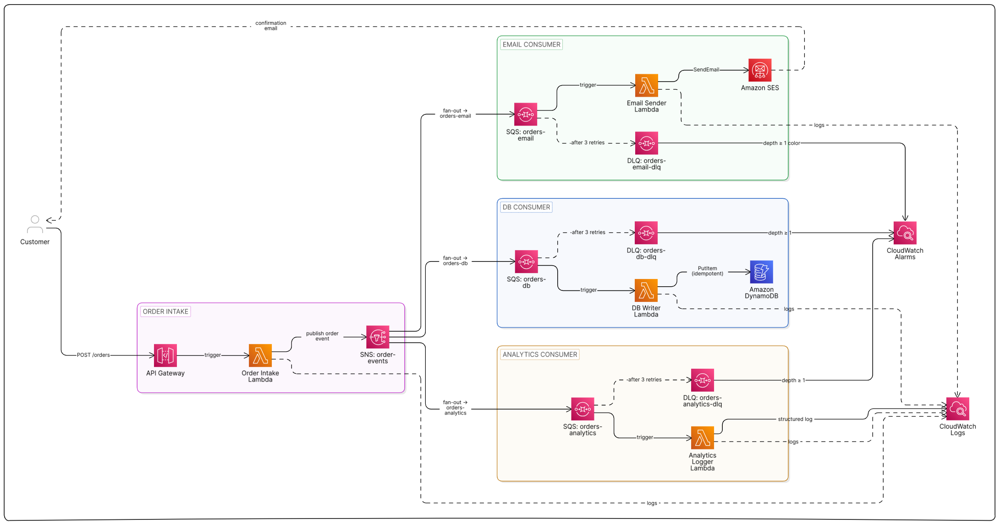
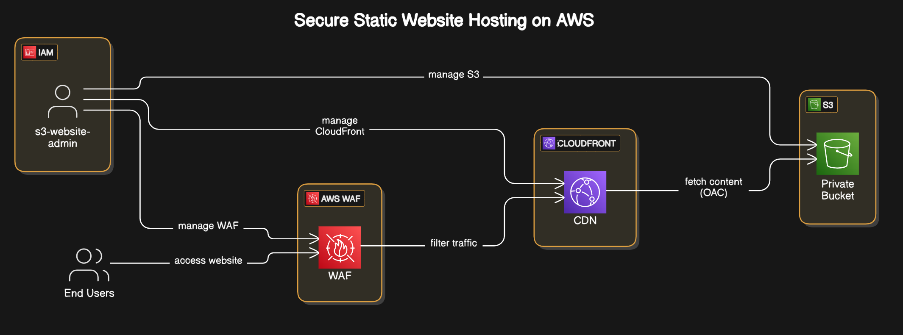
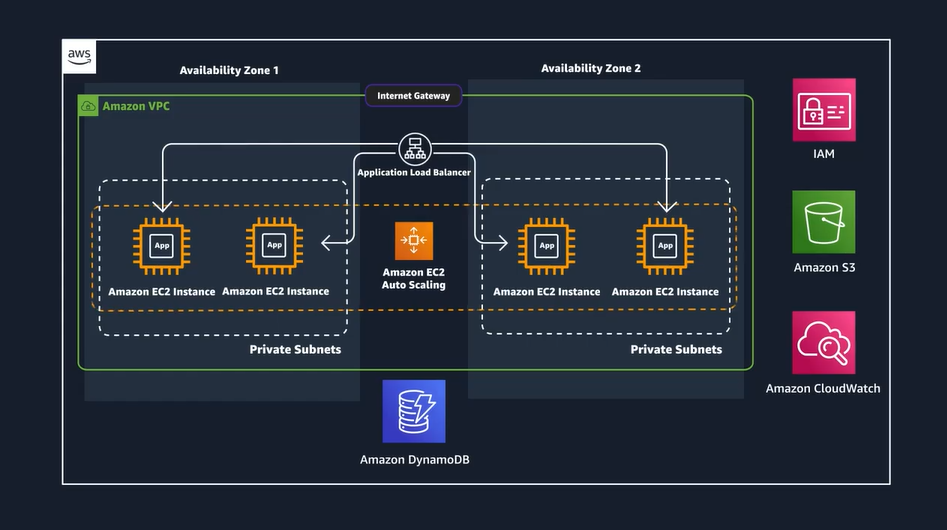
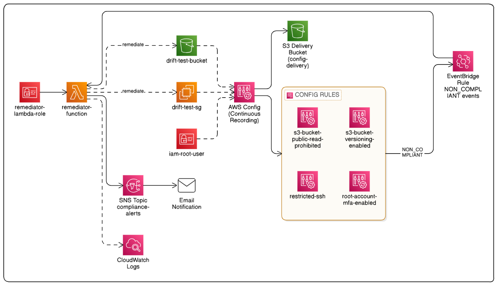
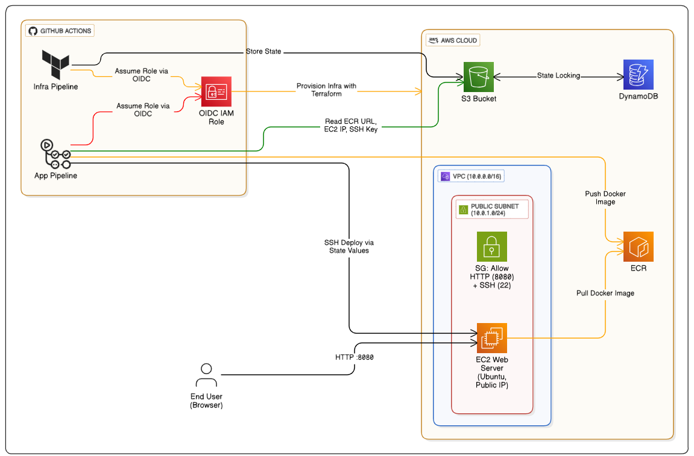
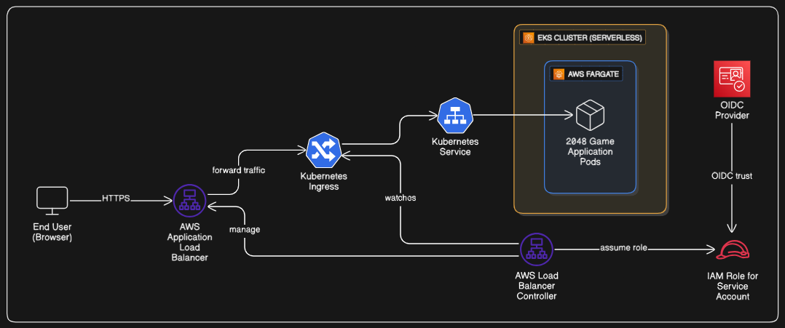

# ☁️ AWS Cloud Portfolio

<div align="center">


[](https://aws.amazon.com/)
[](https://www.terraform.io/)
[](https://www.python.org/)
[](https://www.docker.com/)
[](https://kubernetes.io/)
[](https://aws.amazon.com/serverless/)
[](https://aws.amazon.com/bedrock/)
[](https://aws.amazon.com/event-driven-architecture/)
[](https://aws.amazon.com/security/)
[](https://aws.amazon.com/devops/continuous-integration/)
[](https://opensource.org/licenses/MIT)

_A comprehensive collection of differently architectured AWS cloud solutions_

</div>

---

## 🎯 Overview

This repository serves as the central portfolio and showcase for AWS cloud engineering projects developed under the Darshan Engineering organization.

Each project is maintained in its own dedicated repository and includes:

- Architecture diagrams
- Terraform Infrastructure as Code
- Deployment documentation
- Production-inspired AWS patterns
- Security and operational best practices

> This portfolio provides a structured learning path from foundational cloud services to advanced cloud-native architectures.

## 🗺️ Quick Navigation

| Project                                                                                                | Level           | Core Services                 | Use Case                      |
| ------------------------------------------------------------------------------------------------------ | --------------- | ----------------------------- | ----------------------------- |
| [URL Shortener](https://github.com/atkaridarshan04/aws-serverless-url-shortener)                       | 🟢 Beginner     | Lambda, API Gateway, DynamoDB | Event-driven serverless       |
| [Secure Static Hosting](https://github.com/atkaridarshan04/aws-secure-static-hosting)                  | 🟢 Beginner     | S3, CloudFront, WAF           | CDN + edge security           |
| [AI Summarizer](https://github.com/atkaridarshan04/aws-ai-document-summarizer)                         | 🟠 Intermediate | Bedrock, Textract, Lambda     | AI document processing        |
| [Order Pipeline](https://github.com/atkaridarshan04/aws-event-driven-order-pipeline)                   | 🟠 Intermediate | SNS, SQS, Lambda, SES         | Async messaging + DLQ         |
| [3-Tier App](https://github.com/atkaridarshan04/aws-3tier-ha-app)                                      | 🟠 Intermediate | ALB, Auto Scaling, EC2        | HA web application            |
| [ECS CI/CD](https://github.com/atkaridarshan04/aws-ecs-cicd-pipeline)                                  | 🟠 Intermediate | ECS, CodePipeline             | Container automation          |
| [AWS Terraform GitHub Actions](https://github.com/atkaridarshan04/aws-terraform-github-actions-deploy) | 🟠 Intermediate | Terraform, OIDC               | IaC CI/CD                     |
| [Auth API](https://github.com/atkaridarshan04/aws-serverless-auth-api)                                 | 🔴 Advanced     | Cognito, Lambda, DynamoDB     | Multi-tenant auth             |
| [Streaming Dashboard](https://github.com/atkaridarshan04/aws-realtime-streaming-dashboard)             | 🔴 Advanced     | Kinesis, WebSocket, Lambda    | Real-time data streaming      |
| [Drift Detection](https://github.com/atkaridarshan04/aws-infra-drift-detection)                        | 🔴 Advanced     | Config, EventBridge, Lambda   | Compliance automation         |
| [EKS Fargate](https://github.com/atkaridarshan04/aws-eks-fargate-deployment)                           | 🔴 Advanced     | EKS, Fargate, ALB             | Serverless Kubernetes         |
| [Terraform AWS EC2 platform](https://github.com/atkaridarshan04/terraform-aws-ec2-platform)  | 🔴 Advanced     | ALB, ASG, RDS, WAF, EFS       | Production reference platform |
| [Terraform AWS Container Platform](https://github.com/atkaridarshan04/terraform-aws-container-platform)  | 🔴 Advanced     | ECS, Fargate, ALB, ECR        | Production container platform |
| [Terraform AWS Kubernetes Platform](https://github.com/atkaridarshan04/terraform-aws-kubernetes-platform) | 🔴 Advanced     | EKS, Gateway API, Envoy       | Production Kubernetes platform |

---

## 📚 Project Portfolio

Projects are grouped by category and ordered from foundational to advanced within each group.

---

### ☁️ Serverless & APIs

### 🔗 **Serverless URL Shortener**

<table border="1" cellpadding="15" cellspacing="0" style="border-collapse: collapse; width: 100%; border: 2px solid #FF6B35;">
<tr>
<td width="30%" style="border: 2px solid #FF6B35; padding: 20px; vertical-align: top;">

**[serverless-url-shortener](https://github.com/atkaridarshan04/aws-serverless-url-shortener)**

 

_Event-driven serverless application with API Gateway and Lambda_

- AWS Lambda functions
- API Gateway REST API
- DynamoDB NoSQL database
- S3 static website hosting
- CloudWatch logging

</td>
<td width="60%" style="border: 2px solid #FF6B35; padding: 15px; vertical-align: middle; text-align: center;">


</td>
</tr>
</table>

---

### 🔐 **Serverless Auth + Multi-Tenant API**

<table border="1" cellpadding="15" cellspacing="0" style="border-collapse: collapse; width: 100%; border: 2px solid #7B42BC;">
<tr>
<td width="30%" style="border: 2px solid #7B42BC; padding: 20px; vertical-align: top;">

**[serverless-auth-api](https://github.com/atkaridarshan04/aws-serverless-auth-api)**

 

_JWT-based authentication and tenant-isolated data access using Cognito, API Gateway, Lambda, and DynamoDB_

- Cognito User Pool -> managed auth, JWT issuance
- API Gateway HTTP API native JWT authorizer
- Multi-tenant pool model with DynamoDB
- Tenant isolation enforced at data layer
- Least-privilege IAM per Lambda

</td>
<td width="60%" style="border: 2px solid #7B42BC; padding: 15px; vertical-align: middle; text-align: center;">


</td>
</tr>
</table>

---

### 📦 **Event-Driven Order Processing Pipeline**

<table border="1" cellpadding="15" cellspacing="0" style="border-collapse: collapse; width: 100%; border: 2px solid #E8A838;">
<tr>
<td width="30%" style="border: 2px solid #E8A838; padding: 20px; vertical-align: top;">

**[event-driven-order-pipeline](https://github.com/atkaridarshan04/aws-event-driven-order-pipeline)**

 

_Decoupled, resilient order processing system using SNS fan-out, SQS buffering, and DLQ retry logic_

- SNS → SQS fan-out pattern
- Dead Letter Queues (DLQ) & retry logic
- Lambda consumer per concern (DB, email, analytics)
- DynamoDB idempotent writes
- SES email notifications
- CloudWatch alarms on DLQ depth

</td>
<td width="60%" style="border: 2px solid #E8A838; padding: 15px; vertical-align: middle; text-align: center;">



</td>
</tr>
</table>

---

### 📊 **Real-Time Streaming Dashboard**

<table border="1" cellpadding="15" cellspacing="0" style="border-collapse: collapse; width: 100%; border: 2px solid #00BCD4;">
<tr>
<td width="30%" style="border: 2px solid #00BCD4; padding: 20px; vertical-align: top;">

**[realtime-streaming-dashboard](https://github.com/atkaridarshan04/aws-realtime-streaming-dashboard)**

 

_Live kitchen order display using Kinesis Data Streams, Lambda, DynamoDB, and WebSocket API Gateway_

- Kinesis Data Streams for event ingestion
- Lambda stream processor with batch processing
- WebSocket API Gateway for live push to clients
- DynamoDB for state storage and connection registry
- REST API for initial page load snapshot
- Auto-reconnecting browser dashboard

</td>
<td width="60%" style="border: 2px solid #00BCD4; padding: 15px; vertical-align: middle; text-align: center;">


</td>
</tr>
</table>

---

---

### 🏗️ Infrastructure & Hosting

### 🌐 **Secure Static Website Hosting**

<table border="1" cellpadding="15" cellspacing="0" style="border-collapse: collapse; width: 100%; border: 2px solid #4A90E2;">
<tr>
<td width="30%" style="border: 2px solid #4A90E2; padding: 20px; vertical-align: top;">

**[secure-static-hosting](https://github.com/atkaridarshan04/aws-secure-static-hosting)**

 

_Private S3 bucket with CloudFront CDN and WAF protection_

- Private S3 bucket storage
- CloudFront global CDN
- Origin Access Control (OAC)
- AWS WAF security rules
- HTTPS enforcement

</td>
<td width="60%" style="border: 2px solid #4A90E2; padding: 15px; vertical-align: middle; text-align: center;">



</td>
</tr>
</table>

---

### 🖥️ **3-Tier High Availability Application**

<table border="1" cellpadding="15" cellspacing="0" style="border-collapse: collapse; width: 100%; border: 2px solid #FF9900;">
<tr>
<td width="30%" style="border: 2px solid #FF9900; padding: 20px; vertical-align: top;">

**[3tier-ha-app](https://github.com/atkaridarshan04/aws-3tier-ha-app)**

 

_Production-style 3-tier web application with Auto Scaling and Load Balancing_

- Application Load Balancer (ALB)
- Auto Scaling Groups
- Private subnets with NAT Gateway
- DynamoDB & S3 integration

</td>
<td width="60%" style="border: 2px solid #FF9900; padding: 15px; vertical-align: middle; text-align: center;">



</td>
</tr>
</table>

---

### 🔍 **Infrastructure Drift Detection + Auto-Remediation**

<table border="1" cellpadding="15" cellspacing="0" style="border-collapse: collapse; width: 100%; border: 2px solid #FF5252;">
<tr>
<td width="30%" style="border: 2px solid #FF5252; padding: 20px; vertical-align: top;">

**[infra-drift-detection](https://github.com/atkaridarshan04/aws-infra-drift-detection)**

 

_Continuous compliance monitoring with automatic remediation using AWS Config, EventBridge, and Lambda_

- AWS Config continuous recording
- Four managed compliance rules
- EventBridge `NON_COMPLIANT` routing
- Lambda auto-remediation
- SNS email alerts
- CloudWatch audit trail

</td>
<td width="60%" style="border: 2px solid #FF5252; padding: 15px; vertical-align: middle; text-align: center;">



</td>
</tr>
</table>

---

---

### 🤖 AI & Machine Learning

### 🧠 **AI Document Summarizer**

<table border="1" cellpadding="15" cellspacing="0" style="border-collapse: collapse; width: 100%; border: 2px solid #FF9900;">
<tr>
<td width="30%" style="border: 2px solid #FF9900; padding: 20px; vertical-align: top;">

**[ai-document-summarizer](https://github.com/atkaridarshan04/aws-ai-document-summarizer)**

 

_Event-driven document processing pipeline using S3 triggers, Textract, and Amazon Bedrock_

- S3 event-driven trigger on upload
- Amazon Textract for PDF text extraction
- Amazon Bedrock (Claude) for AI summarization
- DynamoDB for summary storage and retrieval
- API Gateway REST API for summary access

</td>
<td width="60%" style="border: 2px solid #FF9900; padding: 15px; vertical-align: middle; text-align: center;">


</td>
</tr>
</table>

---

---

### 🚢 Containers & CI/CD

### 🚀 **ECS CI/CD Pipeline**

<table border="1" cellpadding="15" cellspacing="0" style="border-collapse: collapse; width: 100%; border: 2px solid #D24939;">
<tr>
<td width="30%" style="border: 2px solid #D24939; padding: 20px; vertical-align: top;">

**[ecs-cicd-pipeline](https://github.com/atkaridarshan04/aws-ecs-cicd-pipeline)**

 

_Automated container deployment with ECS and CodePipeline_

- AWS CodePipeline automation
- ECS container orchestration
- Automated testing & deployment

</td>
<td width="60%" style="border: 2px solid #D24939; padding: 15px; vertical-align: middle; text-align: center;">


</td>
</tr>
</table>

---

### ⚙️ **AWS Terraform GitHub Actions Deploy**

<table border="1" cellpadding="15" cellspacing="0" style="border-collapse: collapse; width: 100%; border: 2px solid #28A745;">
<tr>
<td width="30%" style="border: 2px solid #28A745; padding: 20px; vertical-align: top;">

**[terraform-github-actions-deploy](https://github.com/atkaridarshan04/aws-terraform-github-actions-deploy)**

 

_Complete CI/CD automation with Terraform, GitHub Actions, and OIDC_

- GitHub Actions workflows
- OIDC authentication (no long-lived credentials)
- Automated infrastructure deployment
- Application CI/CD pipelines

</td>
<td width="60%" style="border: 2px solid #28A745; padding: 15px; vertical-align: middle; text-align: center;">



</td>
</tr>
</table>

---

### ☸️ **EKS Fargate Deployment**

<table border="1" cellpadding="15" cellspacing="0" style="border-collapse: collapse; width: 100%; border: 2px solid #326CE5;">
<tr>
<td width="30%" style="border: 2px solid #326CE5; padding: 20px; vertical-align: top;">

**[eks-fargate-deployment](https://github.com/atkaridarshan04/aws-eks-fargate-deployment)**

 

_Serverless Kubernetes with EKS Fargate and Application Load Balancer_

- EKS Fargate serverless compute
- ALB Ingress Controller via Helm
- OIDC + IRSA for pod-level IAM
- Kubernetes deployments

</td>
<td width="60%" style="border: 2px solid #326CE5; padding: 15px; vertical-align: middle; text-align: center;">



</td>
</tr>
</table>

---

### 🏗️ **AWS Reference Architectures**

<table border="1" cellpadding="15" cellspacing="0" style="border-collapse: collapse; width: 100%; border: 2px solid #7B42BC;">
<tr>
<td width="100%" style="border: 2px solid #7B42BC; padding: 20px; vertical-align: top;">

**[terraform-aws-ec2-platform](https://github.com/atkaridarshan04/terraform-aws-ec2-platform)**

 

_Production-grade, highly available web stack = multi-AZ compute, managed database, shared storage, edge security, and full observability_

- Route53 + ACM = DNS and TLS provisioning
- WAF = rate limiting, SQLi, exploit rule sets
- ALB = multi-AZ with HTTP→HTTPS redirect
- ASG / EC2 = private subnets, IMDSv2, SSM-only
- RDS PostgreSQL = multi-AZ, Secrets Manager
- DynamoDB = serverless per-environment table
- EFS = shared filesystem across all instances
- CloudWatch = 12 alarms, 14-widget dashboard
- SNS = ALARM + OK email notifications

</td>
</tr>
<tr>
<td width="100%" style="border: 2px solid #7B42BC; padding: 20px;">

```bash
Internet
   │
   ▼
[Route53]   DNS = apex + www A alias records → ALB
   │
   ▼
[ACM]       TLS certificate, DNS-validated via Route53
   │
   ▼
[WAF]       Regional Web ACL = rate limiting, SQLi, common exploits
   │
   ▼
[ALB]       Public subnets, multi-AZ, HTTP→HTTPS redirect, HTTPS:443
   │
   ▼
[ASG / EC2] Private subnets = nginx + psql client
   ├──► [RDS PostgreSQL]  database subnets, multi-AZ
   ├──► [DynamoDB]        PAY_PER_REQUEST
   └──► [EFS]             shared filesystem, /mnt/efs
   │
   ▼
[CloudWatch]  metrics, logs, alarms, dashboard
   │
   ▼
[SNS → Email] alerts on ALARM + OK
```

</td>
</tr>
</table>


### 🚢 **AWS ECS Container Platform**

<table border="1" cellpadding="15" cellspacing="0" style="border-collapse: collapse; width: 100%; border: 2px solid #FF9900;">
<tr>
<td width="35%" style="border: 2px solid #FF9900; padding: 20px; vertical-align: top;">

**[terraform-aws-container-platform](https://github.com/atkaridarshan04/terraform-aws-container-platform)**


_Production-ready AWS container platform using ECS Fargate with networking, security, auto scaling, managed database, and HTTPS._

- ECS Fargate container platform
- ALB with ACM TLS
- WAF managed protection
- ECR private registry
- RDS MySQL + Secrets Manager
- Route53 DNS automation
- ECS Service Auto Scaling
- Terraform modular architecture

</td>
</tr>
<tr>
<td width="100%" style="border: 2px solid #FF9900; padding: 20px;">

```text
Internet
   │
Route53
   │
WAF
   │
ALB (HTTPS)
   │
ECS Fargate Service
   ├── ECR
   ├── Secrets Manager
   ├── RDS MySQL
   └── DynamoDB
```

</td>
</tr>
</table>


### ☸️ **AWS Kubernetes Platform**

<table border="1" cellpadding="15" cellspacing="0" style="border-collapse: collapse; width: 100%; border: 2px solid #326CE5;">
<tr>
<td width="35%" style="border: 2px solid #326CE5; padding: 20px; vertical-align: top;">

**[terraform-aws-kubernetes-platform](https://github.com/atkaridarshan04/terraform-aws-kubernetes-platform)**


_Production-ready Kubernetes platform on Amazon EKS with managed node groups, Gateway API, Pod Identity, cert-manager, and AWS-native networking._

- Amazon EKS managed cluster
- Managed Node Groups
- Gateway API + Envoy Gateway
- cert-manager + Let's Encrypt
- EKS Pod Identity
- EBS CSI Driver
- Multi-AZ VPC architecture
- Terraform modular platform

</td>
</tr>
<tr>
<td width="100%" style="border: 2px solid #326CE5; padding: 20px;">

```bash
Internet
   │
Network Load Balancer
   │
Envoy Gateway
   │
Gateway API
   │
Kubernetes Services
   │
Pods
   │
Amazon EKS
```

</td>
</tr>
</table>

---

## 🛠️ Skills Demonstrated

| Domain                      | Skills                                                                          |
| --------------------------- | ------------------------------------------------------------------------------- |
| **Cloud Architecture**      | High Availability, Event-Driven Systems, Serverless Design, Distributed Systems |
| **Infrastructure as Code**  | Terraform, State Management, Modular Design                                     |
| **DevOps & CI/CD**          | GitHub Actions, CodePipeline, Containerization, OIDC                            |
| **Security & Identity**     | IAM, Cognito, WAF, Multi-Tenant Architectures                                   |
| **Containers & Kubernetes** | ECS, EKS, Fargate, ALB Ingress Controller, IRSA                                 |
| **AI & Machine Learning**   | Amazon Bedrock (Claude), Textract, Event-Driven ML Pipelines                    |
| **Streaming & Messaging**   | Kinesis Data Streams, SNS, SQS, WebSocket API, DLQ                              |

## 📄 License

This project is licensed under the MIT License - see the [LICENSE](LICENSE) file for details.

---

<div align="center">

**⭐ Star this repository if you find it helpful!**

</div>
